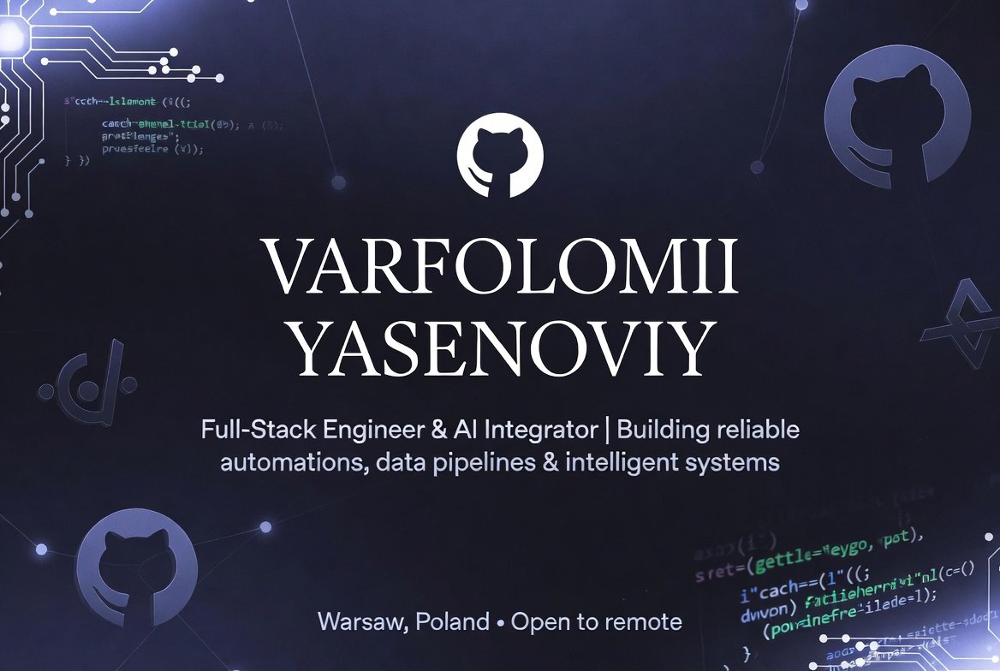

  

  
  
  
  

## Hey, I'm Varfolomii

Full-stack engineer focused on Python ecosystem, reliable data pipelines, and AI/ML integrations that actually get used in production.

I design and build systems that turn messy manual processes into stable, observable, and low-maintenance workflows. Strong emphasis on backend (FastAPI, data engineering, ETL), production ML/LLM features (recommendation systems, RAG, classification models), robust scraping, and clean APIs that other developers can trust.

---

### 🛠 Tech Stack

  

---

### 📈 GitHub Activity

  
  

---

### What I build

- **Recommendation & search systems** — designed hybrid approaches (collaborative filtering + semantic/keyword matching) for event platforms. Moved from generic “popular” results to actually relevant local events. Engagement metrics improved within first months.
- **Production data pipelines & ETL** — automated ingestion, normalization and synchronization from multiple sources into databases and notification channels. Dramatically reduced manual reconciliation work.
- **Robust scraping infrastructure** — built and maintained scrapers for JS-rendered sites with anti-bot protection, rotating proxies and resilient selectors. One pipeline processed ~18k records nightly with high reliability; another survived multiple site redesigns without full rewrites.
- **LLM & AI integrations in production** — RAG-powered support bots connected to company knowledge bases + tickets, automated content generation, lead scoring pipelines. One deployment reduced repetitive support tickets by ~37%.
- **Python backends & tooling** — FastAPI services for data processing and APIs, Flask admin panels, Telegram bots with proper error handling and retry logic. Often paired with lightweight React or Vue dashboards.
- **ML models in real catalogs** — productionized classification models on text + metadata that reached 87% live accuracy and replaced brittle rule-based systems.

I focus on systems that are observable, documented, and don’t require constant babysitting. Clean contracts, meaningful tests, and code that the next developer can actually work with.

---

### Side direction

Exploring contract-first design for automated testing and agentic workflows, especially in complex simulation environments. Goal is to make reliable AI-assisted QA and testing as approachable as modern web development tooling.

---

### Let's connect

- **Email**: yasenvarf@gmail.com
- Based in **Warsaw, Poland** — open to remote roles worldwide
- Interested in Python-heavy fullstack/backend roles, AI/ML platform work, data pipelines, MLOps-ish tooling, or building internal developer platforms.

If you’re building something that needs reliable automation, production-grade data flows, or AI features that teams actually keep using — happy to talk.

---

  Stats update automatically • Clean Python + AI/ML focus • Theme: radical + custom banner

